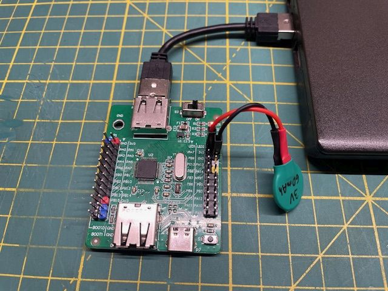
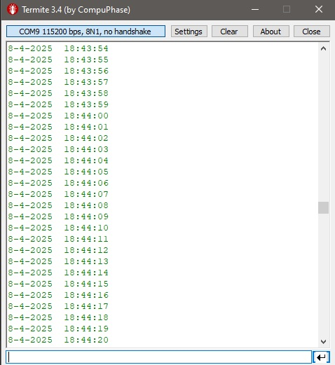

# CH32V203_USBCDC_RTC
Example of using RTC and USB CDC for the CH32V203 microcontroller

A simple example of using the RTC peripheral on the CH32V203 microcontroller. 
Communication is done via the USB CDC interface. 
Through a serial terminal, it displays the date and time from the microcontroller’s internal RTC peripheral. 
The date and time can be set by sending a string in the format 8-4-2025 13:23:03. For RTC backup, the Vbat pin is powered by a 3V CR1620 battery. 
The current consumption when the main power is off is only 1.2 µA, allowing the RTC to keep running for around 5. years. Everything is connected on the official WCH development board with the CH32V203C8T6 microcontroller.

Test setup:

Output:

